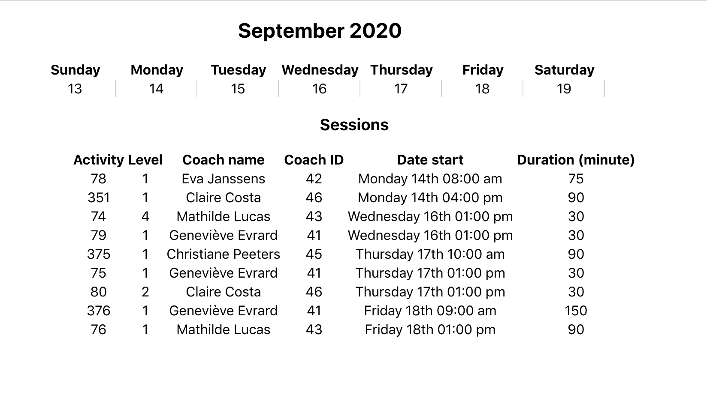

# A calendar using REACTJS

The project build a simple calendar shows the offers of a company in the current week. The offers are fetched from a true [API](https://back.staging.bsport.io/api/v1/swagger/). By selecting a day on the calendar we can filter the offers in the day.

The information of a coach are also fetched from the API for only the coach ID appearing in the offers during the week. The offers list displays the name of coach.




This project was bootstrapped with [Create React App](https://github.com/facebook/create-react-app).


### Development

```
npm start
```

Open [http://localhost:3000](http://localhost:3000) to view the app in the browser.


### Production

```
npm run build
```

